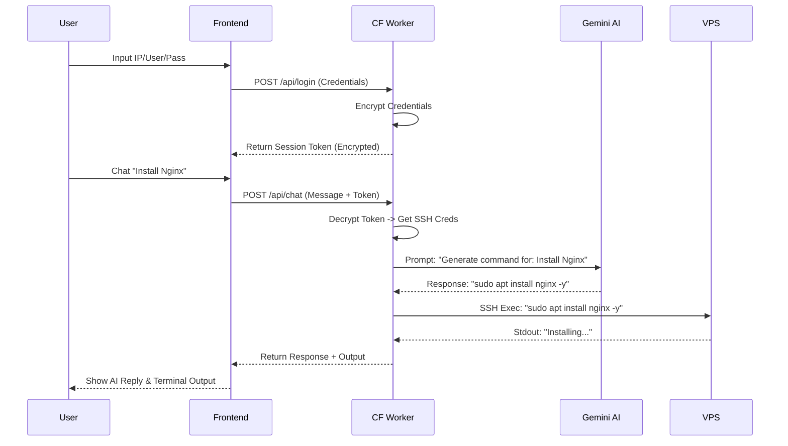

# Arsitektur & Dokumentasi VPS AI Dashboard

## A. Arsitektur Sistem

Sistem ini dibangun menggunakan arsitektur Serverless dengan Cloudflare Workers sebagai backend utama yang menjembatani antara Client (Browser), VPS (via SSH), dan Google Gemini AI.

**Komponen Utama:**
1.  **Frontend (Client):** Single Page Application (SPA) berbasis HTML/CSS/JS murni. Berjalan di browser pengguna, berkomunikasi dengan backend via HTTP REST API dan WebSocket (untuk terminal/realtime).
2.  **Backend (Cloudflare Workers):**
    -   **Auth:** Menangani enkripsi/dekripsi kredensial VPS.
    -   **SSH Bridge:** Menggunakan library SSH (dengan kompatibilitas Node.js) untuk terhubung ke VPS target.
    -   **AI Controller:** Mengirim prompt ke Gemini API dan memproses respons menjadi perintah shell.
3.  **External Services:**
    -   **Google Gemini API:** Untuk intelegensi buatan (Code generation, command interpretation).
    -   **Target VPS:** Server Linux yang dikelola via SSH.

## B. Flow Diagram



## C. Struktur Folder Project

```text
vpsai/
├── docs/               # Dokumentasi Proyek
│   └── ARCHITECTURE.md
├── public/             # Frontend Assets (hosted via Workers Sites/Assets)
│   ├── index.html      # UI Utama
│   ├── style.css       # Styling
│   └── app.js          # Client-side Logic
├── scripts/            # Helper Scripts
│   └── setup_vps.sh    # Auto-install AI Environment script
├── src/                # Backend Source Code
│   ├── index.ts        # Entry point & Router (Hono)
│   ├── ssh.ts          # SSH Handler
│   ├── gemini.ts       # AI Integration
│   └── security.ts     # Encryption helpers
├── package.json        # Dependencies
└── wrangler.toml       # Cloudflare Config
```

## H. Script Auto Install VPS

Script ini dijalankan di VPS untuk menyiapkan environment AI (Python, pip, venv).
Lihat file: `scripts/setup_vps.sh`

## I. Contoh Database Schema

Meskipun sistem ini stateless (menyimpan sesi di client side token), jika menggunakan Cloudflare D1 untuk logging histori chat:

```sql
CREATE TABLE IF NOT EXISTS chat_history (
    id INTEGER PRIMARY KEY AUTOINCREMENT,
    user_ip TEXT,
    vps_host TEXT,
    command TEXT,
    ai_response TEXT,
    timestamp DATETIME DEFAULT CURRENT_TIMESTAMP
);

CREATE TABLE IF NOT EXISTS ssh_sessions (
    session_id TEXT PRIMARY KEY,
    encrypted_creds TEXT,
    created_at DATETIME DEFAULT CURRENT_TIMESTAMP
);
```

## J. Cara Deploy ke Cloudflare Workers

1.  **Install Wrangler:**
    ```bash
    npm install -g wrangler
    ```

2.  **Login ke Cloudflare:**
    ```bash
    wrangler login
    ```

3.  **Deploy:**
    ```bash
    npm run deploy
    # atau
    wrangler deploy
    ```
    Frontend (folder `public`) akan otomatis di-upload sebagai static assets (jika dikonfigurasi di wrangler.toml) atau perlu bucket R2/Pages terpisah tergantung konfigurasi. Di konfigurasi ini kita menggunakan `[site]` bucket.

## K. Cara Testing

1.  **Local Development:**
    ```bash
    npm run dev
    ```
    Akses `http://localhost:8787`.

2.  **Unit Testing (Optional):**
    Buat file test menggunakan `vitest`.

3.  **Integration Test:**
    -   Buka Web Dashboard.
    -   Masukkan IP VPS, User, Password (VPS dummy atau real).
    -   Pilih Model Gemini.
    -   Masukkan API Key Gemini.
    -   Ketik perintah di chat "Cek memori server".
    -   Pastikan output terminal muncul.
